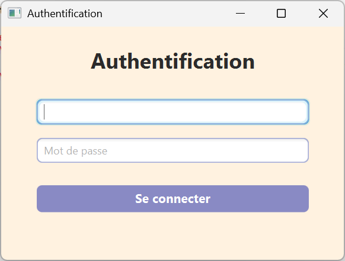
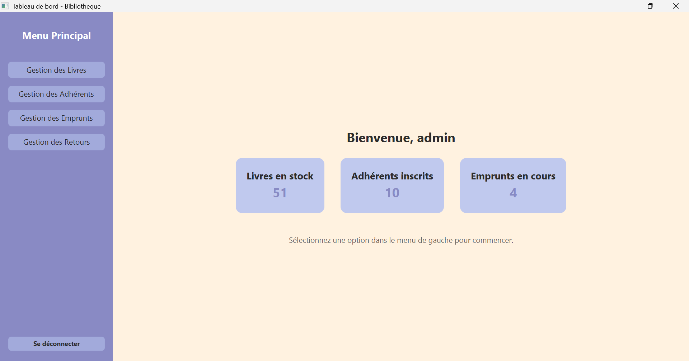
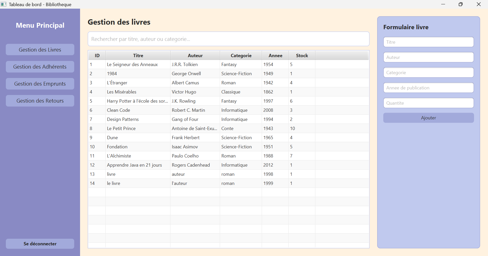
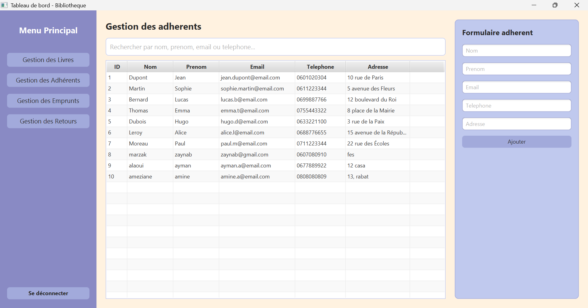
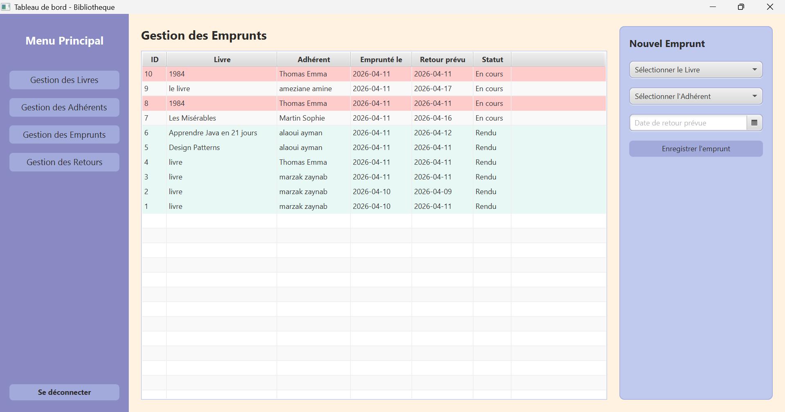
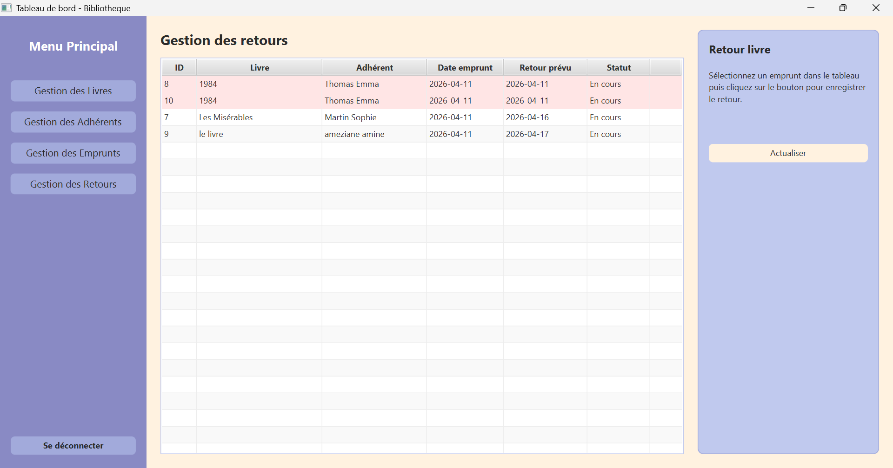

# 📚 Library Management System

A lightweight desktop application built with **Java, JavaFX, Maven, and Microsoft Access (UCanAccess)** for managing the core operations of a library.
It helps administrators handle books, members, loans, and returns through a simple and structured interface.

---

## 🧩 Project Overview

| File / Folder | Purpose |
|---------------|---------|
| `pom.xml` | Maven configuration and project dependencies |
| `bibliotheque.accdb` | Microsoft Access database used by the application |
| `src/main/java/application/` | Application entry point and startup logic |
| `src/main/java/acces_donnees/` | Database access layer (JDBC / UCanAccess) |
| `src/main/java/logique/` | Controllers and business logic |
| `src/main/java/modele/` | Data model classes |
| `src/main/resources/interface_graphique/` | JavaFX FXML interface files |

---

## ⚡ Quick Start

Clone or download the project, open it in **Eclipse** as a Maven project, make sure the database path is correctly configured, then run the application.

Example repository format:

```bash
git clone https://github.com/your-username/library-management-system.git
cd library-management-system
```

Runs locally with **Eclipse**.

---

## ✨ Features

- 🔐 User authentication system
- 📚 Book management
- 👤 Member management
- 📝 Loan registration
- ↩️ Return processing
- 📊 Dashboard with quick statistics
- 🔎 Search and filtering inside management tables
- ⚠️ Visual highlighting for overdue loans
- ♻️ Structured Java project with separated model, logic, and data-access layers

---


## 📸 Application Preview

### 🔐 Login Page


### 🧭 Dashboard


### 🧑‍🎓 Books Management


###  Members Management


###  Loans Management


###  Returns Management



---

## 🧭 How It Works

1. Log in with a valid user account  
2. Access the dashboard  
3. Manage books and member records  
4. Register new loans  
5. Validate returns  
6. Monitor statistics and loan status  

---

## 🛠️ Tech Stack

- **Language:** Java
- **Frontend:** JavaFX, FXML, CSS, SceneBuilder
- **Backend / Logic:** Java
- **Database:** Microsoft Access (`.accdb`)
- **Database Access:** JDBC + UCanAccess
- **Build Tool:** Maven
- **IDE:** Eclipse

---

## 📦 Installation

### 1. Clone the repository

```bash
git clone https://github.com/your-username/library-management-system.git
cd library-management-system
```

### 2. Open the project in Eclipse

- Open **Eclipse**
- Choose **File > Import**
- Select **Existing Maven Projects**
- Browse to the project folder
- Finish the import

### 3. Check Java and Maven configuration

Make sure your environment supports the Java version configured in `pom.xml`.

Also allow Eclipse to download the Maven dependencies:

- JavaFX
- UCanAccess

### 4. Configure the database path

This project uses the `bibliotheque.accdb` database file.

If the project still contains a machine-specific path in `DBConnection.java`, update it before running the application.
For a cleaner GitHub version, it is recommended to use a **relative path** pointing to the database file inside the project folder.

### 5. Run the application

In Eclipse:

- Locate `application/Main.java`
- Right-click the file
- Choose **Run As > Java Application**

If everything is configured correctly, the login window should appear.

---

## 🌍 Portability Notes

This project can be made easier to share and run on different machines by:

- removing machine-specific database paths
- keeping dependencies managed by Maven
- avoiding IDE-generated build files in the GitHub repository
- using a clean project structure for Eclipse and GitHub publication

That makes it more suitable for collaboration, evaluation, and demonstration.

---

## 🔒 Authentication Notes

Access depends on the user accounts stored in the Access database.

Before testing the login:

- make sure the database file is available
- verify that at least one user account exists in the `utilisateur` table
- confirm that the login and password values match the stored data

---

## 🧪 Testing Checklist

| Test | What to Check |
|------|---------------|
| Login | User authentication works correctly |
| Book management | Add, edit, search, and delete books |
| Member management | Add, edit, search, and delete members |
| Loan flow | Register a loan and update stock correctly |
| Return flow | Validate returns and update loan status |
| Dashboard | Statistics display correctly |
| Late loans | Overdue items are visually highlighted |

---

## 🧰 Troubleshooting

### ❌ Database connection error?

- Check the Access database path in `DBConnection.java`
- Confirm that `bibliotheque.accdb` exists
- Make sure the UCanAccess dependency was downloaded successfully
- Verify that the database file is not locked by another program

### ❌ JavaFX interface not loading?

- Confirm that the FXML files are inside `src/main/resources/interface_graphique/`
- Make sure Eclipse recognizes the `resources` folder correctly
- Refresh and update the Maven project if needed

### ❌ Application not starting in Eclipse?

- Check that the JDK version matches the one expected by the project
- Run **Maven > Update Project**
- Clean and rebuild the project
- Verify that `Main.java` is used as the launch class

---

## 🚀 Possible Improvements

- role-based access control
- better input validation
- export to PDF / Excel
- automated notifications for overdue loans
- improved dashboard analytics
- stronger exception handling and logging
- more modern and responsive UI styling

---

## 🤝 Contributing

Contributions are welcome, especially in:

- UI/UX improvements
- validation and security enhancements
- cleaner database configuration
- code refactoring and modularization
- reporting and export features

---

## 📄 License

This project was developed for **academic and educational purposes**.

You may adapt or extend it for learning and demonstration use.

---

**❤️ Made with love: Zaynab**
